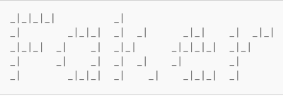

# ARATP
<h1> Automation of REST API testing in Python </h1>

<a target="_blank" href="https://playground.learnqa.ru/api/map/">LearnQA API</a>

<!-- Technologies used in the project -->

<h2> Technologies used in the project</h2>

  <code></code>
  <code></code>
  <code></code>
  <code></code>
  <code></code>
  <code></code>
  <code></code>
  <code></code>
  <code></code>
  <code></code>

<!-- Test cases -->

<h2>Automation of API methods depending on HTTP request type:</h2>

* ✅ Create user
* ✅ Logs user into the system
* ✅ Get user id you are authorizes as OR get 0 if not authorized
* ✅ Get user info by id
* ✅ Update user
* ✅ Delete user by id

<!-- Docker -->

<h2>Creating a project image in Docker</h2>
docker build -t pytest_runner

### Running tests from a project image in Docker
docker run --rm --mount type=bind,src="project_folder",target=/tests_project/ pytest_runner

<!-- Docker Compose -->

<h2>Creating a project image in Docker Compose</h2>
docker-compose build

### Running tests from a project image in Docker Compose
docker-compose up

<!-- Allure report -->

<h2> Allure report </h2>

  <code></code>

  <code></code>

  <code></code>

  <code></code>

  <code></code>

